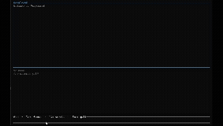

# Perplexed

A local, self-hosted Perplexity clone in Rust. Ask a question in a terminal UI and it searches the web, reads the pages, and streams a cited answer from a local LLM. Nothing leaves your machine except the searches and page fetches.



## Pipeline

```
query → rewrite (conversation-aware) → decompose into 1-4 sub-queries
      → SearxNG search → fetch pages → extract readable text → chunk
      → rerank (embeddings) → rerank (cross-encoder) → build cited context
      → stream answer
```

See `architecture.excalidraw.png` for the diagram.

## Requirements

- Rust
- Docker (for SearxNG)
- [Ollama](https://ollama.com) with `qwen2.5:7b` and `mxbai-embed-large`

The BGE cross-encoder reranker is downloaded automatically on first run into `.fastembed_cache`.

## Run

```bash
# 1. start the search backend (localhost:8888)
docker compose up -d

# 2. pull the models
ollama pull qwen2.5:7b
ollama pull mxbai-embed-large

# 3. run
cargo run --release
```

## Keys

| Key | Action |
| --- | --- |
| `Enter` | ask |
| `Tab` | switch focus between the conversation and sources panes |
| `↑` / `↓` | scroll the focused pane |
| `Esc` / `Ctrl-C` | quit |

## Config

Endpoints and model names are constants at the top of [src/pipeline.rs](src/pipeline.rs).
